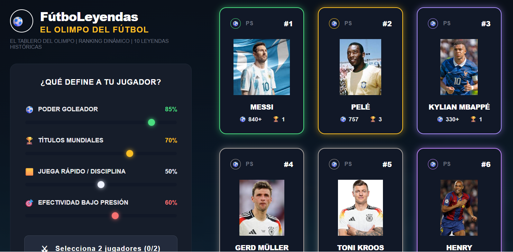
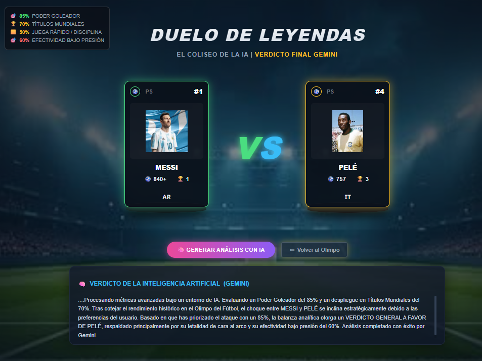

# FutboLeyendas ⚽🤖
Plataforma web interactiva desarrollada en React para enfrentar a 21 leyendas del fútbol mundial. Ajusta los sliders de atributos en tiempo real y deja que el veredicto inteligente de Gemini decida quién domina el Olimpo del fútbol

## Introducción
El debate sobre quién es el mejor jugador de todos los tiempos (GOAT) es el motor de la pasión futbolera global. Sin embargo, las discusiones suelen basarse en emociones o datos aislados. 
Esta plataforma transforma el debate histórico en una experiencia interactiva y viva, donde la estadística, la gloria mundialista y la tragedia de los momentos cruciales (como los penaltis fallados) se enfrentan al criterio del usuario para basarnos en información objetiva.

---

## Objetivo del Proyecto
Desarrollar una aplicación web interactiva que permita a los usuarios preseleccionar y comparar 21 leyendas del fútbol mundial en tiempo real. La plataforma no solo expone datos estadísticos crudos, sino que permite al usuario ponderar dinámicamente qué atributos valora más (goles, títulos, liderazgo, efectividad en momentos de presión) para obtener un veredicto definitivo asistido por Inteligencia Artificial.

---

## La Situación / Problema / El Diagnóstico Técnico
* **Subjetividad en el Análisis:** Los debates futbolísticos carecen de un entorno donde las estadísticas históricas se puedan contrastar de forma paramétrica y personalizada.
* **Datos Estáticos:** Las plataformas actuales muestran tablas fijas, impidiendo que un usuario evalúe, por ejemplo, cómo afectaría el rendimiento histórico de un jugador si se priorizaran los títulos internacionales sobre los goles en clubes.
* **Procesamiento de Contexto Complejo:** Evaluar cualitativamente la carrera de jugadores de distintas épocas (como Pelé vs. Messi) requiere un análisis semántico e histórico avanzado que las bases de datos tradicionales no pueden resolver por sí solas.

---

## Propuesta de Valor
* **Sliders de Atributos Dinámicos:** El usuario ajusta variables en tiempo real para definir sus propios criterios de peso estadístico.
* **Veredicto Inteligente:** Integración de modelos de lenguaje (LLM - Gemini) que actúan como un "juez deportivo neutral", analizando el pool de datos del jugador cruzado con las preferencias exactas del usuario.
* **Estructura Escalable:** Desarrollado bajo la simulación de un entorno profesional ágil con entregas e hitos semanales (*weekChallenge*).

---

## Requerimientos
* **Frontend React (Vite):** Interfaz fluida, reactiva y optimizada con soporte para renderizado rápido y manipulación de estados locales de los sliders.
* **Manejo de Estados Eficiente:** Controlar la selección de las 21 leyendas y el procesamiento de sus atributos sin renderizados innecesarios.
* **Integración con API de IA:** Conexión segura para enviar el contexto estructurado de los futbolistas y recibir un análisis cualitativo en segundos.
* **Responsive Design:** Garantizar una experiencia inmersiva tanto en computadoras de escritorio como en dispositivos móviles.

---

## La Solución / Diagrama Visual & Arquitectura

### Arquitectura de la Aplicación
La aplicación sigue una arquitectura desacoplada basada en componentes reutilizables de React y un flujo de datos unidireccional:

[ Interfaz de Usuario (React + CSS) ]
       │                ▲
       ▼                │ (Actualiza Estado)
[ Controladores de Estado Local (Sliders / Selección) ]
       │
       ▼ (Estructura el Prompt de Contexto Histórico)
[ Servicio de Integración API (Gemini LLM) ]

## Pantallas

### 1. El Tablero del Olimpo (Dashboard Principal)

Esta es la vista inicial de la plataforma. Sirve como centro de mando dinámico para que el usuario configure las reglas del debate y examine a los candidatos antes del enfrentamiento.

  

*   **Sliders de Atributos Personales ("¿Qué define a tu jugador?"):** Cuatro deslizadores interactivos que permiten al usuario ponderar en tiempo real el valor que le otorga al **Poder Goleador**, **Títulos Mundiales**, **Juega Rápido / Disciplina** y **Efectividad Bajo Presión**.
*   **Malla de Leyendas Históricas:** Tarjetas individuales e interactivas para cada futbolista que muestran su posición en el ranking (`#1`, `#2`, etc.), su fotografía, goles totales anotados (`840+`, `757`) y copas del mundo ganadas.
*   **Botonera de Selección:** Indicador inferior (`Selecciona 2 jugadores`) para controlar el flujo de la aplicación antes de habilitar el pase a la arena de combate.

---

### 2. Duelo de Leyendas (El Coliseo de la IA)

Esta pantalla representa la arena de confrontación directa. Muestra visualmente el cara a cara de los dos futbolistas elegidos y procesa los datos bajo el criterio personalizado del usuario.

  

*   **Panel de Ponderación Activa:** Un indicador en la esquina superior izquierda que recuerda los porcentajes exactos que el usuario configuró en los sliders de la pantalla anterior.
*   **Tarjetas de Confrontación (VS):** Despliegue estético central de las dos leyendas seleccionadas en formato frente a frente para contrastar directamente sus métricas clave.
*   **Acciones de Control:**
    *   **Generar Análisis con IA:** Botón principal que dispara la petición estructurada con el contexto estadístico hacia el modelo Gemini.
    *   **Volver al Olimpo:** Botón de escape que permite regresar al tablero inicial para resetear los valores o elegir nuevos contrincantes.
*   **Módulo "Veredicto de la Inteligencia Artificial (Gemini)":** Espacio dedicado en la zona inferior donde se imprime el análisis semántico y detallado de la IA, otorgando un veredicto final justificado objetivamente en base a las preferencias y variables ingresadas por el usuario.